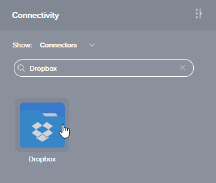
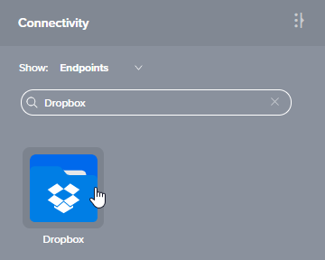
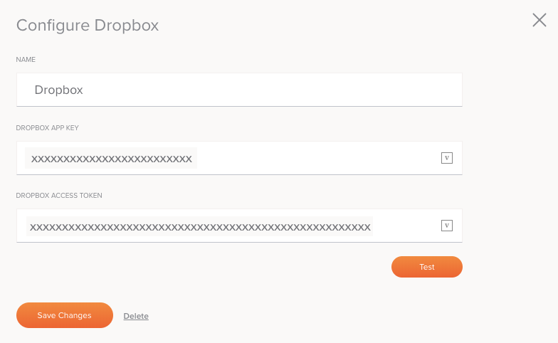

# Jitterbit Harmony Dropbox Connection

## Introduction

A Dropbox connection is configured using the Dropbox connector, establishing access to the Dropbox endpoint. Once a
connection is established, you can configure one or more Dropbox activities associated with that connection to
use as either a source to provide data to an operation or as a target to consume data in an operation.

## Creating or Editing a Dropbox Connection

From the design canvas, open the **Connectivity** tab of the design component palette:

To configure a new Dropbox connection, use the **Show** dropdown to filter on **Connectors**, and then click the
Dropbox connector block:

To configure an existing Dropbox connection, use the **Show** dropdown to filter on **Endpoints**, and then
double-click the Dropbox connection block:

These open a configuration screen for the Dropbox connection, covered next.

## Configuring a Dropbox Connection

Configuration of a Dropbox connection includes these fields:

**TIP:** Fields with a variable icon  support using
[global variables](https://success.jitterbit.com/display/CS/Global+Variables),
[project variables](https://success.jitterbit.com/display/CS/Project+Variables), and
[Jitterbit variables](https://success.jitterbit.com/display/CS/Jitterbit+Variables). Begin by either typing an open
square bracket `[` into the field or by clicking the variable icon to display a list of the existing variables to
choose from.

- **Endpoint Name:** Enter a name to use to identify the Dropbox connection. The name must be unique for each Dropbox
  connection and must not contain forward slashes (`/`) or colons (`:`).

- **Dropbox App Key:** Enter the Dropbox app key that you previously saved. See
  [Dropbox Registration](./registration.md).

- **Dropbox Access Token:** Enter the Dropbox access token that you previously saved. See
  [Dropbox Registration](./registration.md).

- **Test:** Click to verify the connection using the provided credentials.

- **Save Changes:** Click to save and close the connection configuration.

- **Discard Changes:** After making changes to a new or existing configuration, click to close the configuration
  without saving. A message asks you to confirm that you want to discard changes.

- **Delete:** After opening an existing connection configuration, click to permanently delete the connection
  from the project and close the configuration (see
  [Component Dependencies, Deletion, and Removal](https://success.jitterbit.com/display/CS/Component+Dependencies%2C+Deletion%2C+and+Removal)).
  A message asks you to confirm that you want to delete the connection.

## Next Steps

After configuring a Dropbox connection, you can configure one or more Dropbox activities associated with that
connection to be used either as a source to provide data to an operation or as a target to consume data in an
operation. For more information, see these pages:

- **[Fetch File](./fetch-file-activity.md):** Retrieves data from a Dropbox connection and is intended to be used as
  a source in an operation.

- **[Get File](./get-file-activity.md):** Lets a user (at configuration time) select from different files associated
  with a path (a directory) at Dropbox and specify a schema. At runtime, the activity downloads the file and parses
  it using the specified schema. The activity is intended to be used as a source in an operation.

- **[Process File](./process-file-activity.md):** Retrieves data from a Dropbox connection, processes the file based
  on a specified schema, and is intended to be used as a source in an operation.

- **[Put File](./put-file-activity.md):** Inserts new data into a Dropbox connection and is intended to be used as
  a target in an operation.
