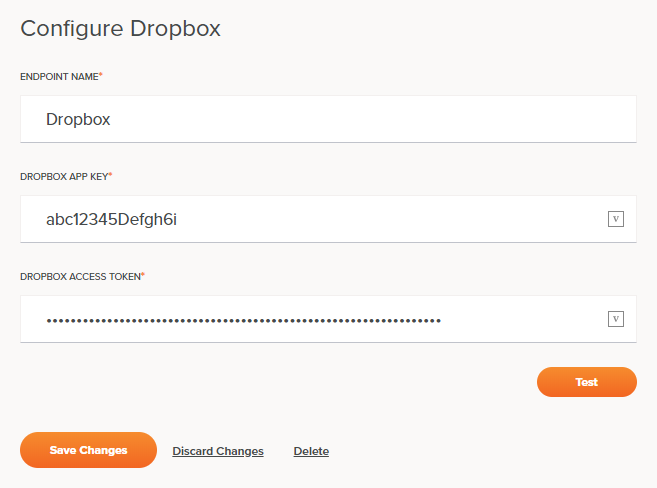

# Jitterbit Harmony Dropbox Connection

## Introduction

A Dropbox connection is configured via the Dropbox connector to establish access to an account on the Dropbox server.
Once a connection is established, you can configure one or more Dropbox activities associated with that connection to
use as a source or target within an operation.

## Creating or Editing a Dropbox Connection

From the design canvas, open the **Connectivity** tab of the design component palette:

To configure a new Dropbox connection, within the **Connectors** filter, click the Dropbox connector block:

To configure an existing Dropbox connection, within the **Endpoints** filter, double-click the Dropbox connection block:

This will open a configuration screen for the Dropbox connection, covered next.

## Configuring a Dropbox Connection

Configuration of a Dropbox connection includes these fields:

**TIP:** Fields with a variable icon  support using global variables,
project variables, and Jitterbit variables. Begin typing an open square bracket `[` into the field or click the variable
icon to display existing variables to choose from.

- **Name:** Enter a name to use to identify the Dropbox connection. The name must be unique for each Dropbox connection
  and must not contain forward slashes (`/`) or colons (`:`).

- **Dropbox App Key:** Enter the Dropbox app key that you previously saved. See [Dropbox
  Registration](./registration.md).

- **Dropbox Access Token:** Enter the Dropbox access token that you previously saved. See
  [Dropbox Registration](./registration.md).

- **Test:** Click this button to verify the connection. The server will check only that the specified user can make
  connection.

- **Save Changes:** Click this button to save and close the connection configuration.

- **Discard Changes:** After making changes to a new or existing configuration, click **Discard Changes** to close the
  configuration without saving. A message will ask you to confirm that you want to discard changes.

- **Delete:** After opening an existing connection configuration, click **Delete** to permanently delete the connection
  from the project and close the configuration (see [Component Dependencies, Deletion, and
  Removal](https://success.jitterbit.com/display/CS/Component+Dependencies%2C+Deletion%2C+and+Removal)).

## Next Steps

After configuring a Dropbox connection, you can configure one or more Dropbox activities associated with that connection
to use as a source or target within an operation. For more information, see these pages:

- **[Fetch File](./fetch-file-activity.md):** Retrieves data from a Dropbox connection and is used as a source in an
  operation.

- **[Get File](./get-file-activity.md):** Lets a user (at configuration time) select from different files associated
  with a path (a directory) at Dropbox and specify a schema. At runtime, the activity downloads the file and parses it
  using the specified schema. The activity is used as a source in an operation.

- **[Process File](./process-file-activity.md):** Retrieves data from a Dropbox connection, processes the file based on
  a specified schema, and is used as a source in an operation.

- **[Put File](./fetch-file-activity.md):** Inserts new data into a Dropbox connection and is used as a target in an
  operation.
