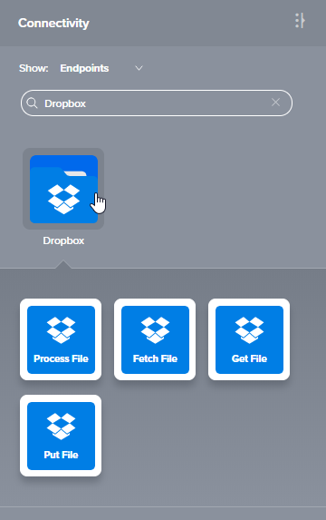
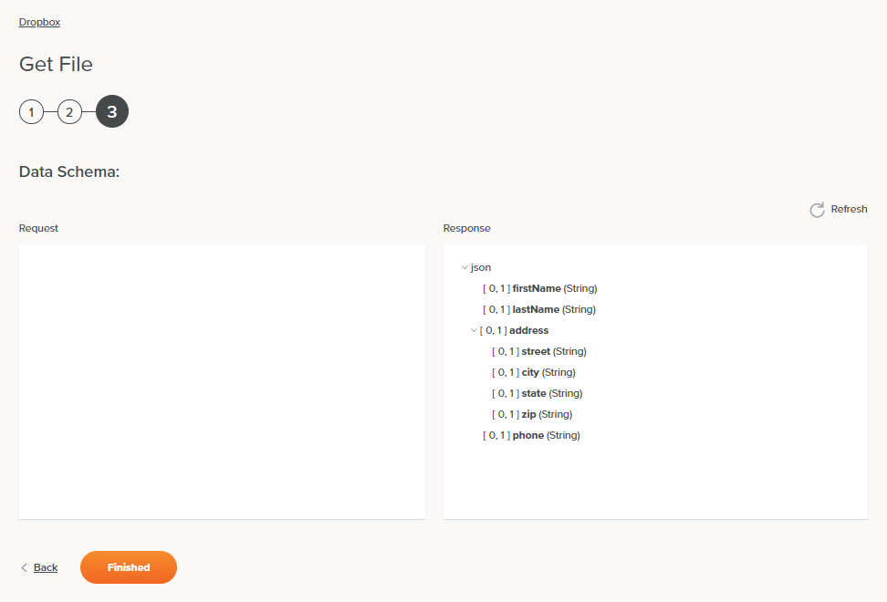

# Jitterbit Harmony Dropbox Get File Activity

## Introduction

A Dropbox Get File activity lets a user (at configuration time) select from different files associated with a path
(a directory) at Dropbox and specify a schema. At runtime, the activity downloads the file and parses it using the
specified schema. The activity is intended to be used as a source to provide data in an operation. After configuring
a Dropbox connection, you can configure as many Dropbox activities as you like for each Dropbox connection.

## Creating a Dropbox Activity

From the design canvas, open the **Connectivity** tab of the design component palette:

Use the **Show** dropdown to filter on **Endpoints**, and then click the Dropbox connection block to display
activities that are available to be used with a Dropbox connection:

To create an activity that can be configured,
[drag the activity block](https://success.jitterbit.com/display/CS/Connectors#Connectors-activity) from the palette
to the operation.

For more information about the parts of an operation and adding activities to operations, see
[Operation Creation and Configuration](https://success.jitterbit.com/display/CS/Operation+Creation+and+Configuration).

## Accessing Menu Actions

After a Dropbox activity has been added to an operation, menu actions for that activity are accessible from the
project pane in either the **Workflows** or the **Components** tabs, and from the design canvas:

- **Project Pane:** In the **Workflows** or **Components** tab of the project pane, hover over an activity name and
  click the actions menu icon to open the actions menu.

- **Design Canvas:** Within the operation, click an existing activity block to open the actions menu.

Each of these menu actions is available:

- **View/Edit:** Opens the activity configuration screen for you to configure the activity. For details, see
  *Configuring a Dropbox Get File Activity* later on this page.

- **Delete:** Permanently deletes the activity. A message asks you to confirm that you want to delete the activity.

- **Rename:** Positions the cursor on the activity name in the project pane for you to make edits.

- **View Dependencies:** Changes the view in the project pane to display any other parts of the project that the
  activity is dependent on.

- **Remove:** Removes the activity as a step in the operation without deleting it from the project. (This is
  available only from the actions menu on the design canvas.) When you remove an activity that is adjacent to a
  transformation and schemas are provided within that activity, the schemas are longer referenced by the
  transformation. Removed components can be accessed or permanently deleted from the project pane.

- **Deploy:** Deploys the activity and any components it is dependent on.

- **Configurable Deploy:** Opens the deployment screen, where you can select project components to deploy.

- **Add to Group:** Opens a prompt to create a new custom group or to add the component to an existing group.

- **Duplicate:** Creates a copy of the activity as a new, unreferenced component. On creating the component
  copy, the cursor is positioned on the component name within the project pane for you to rename the component.

## Configuring a Dropbox Get File Activity

Follow these steps to configure a Dropbox Get File activity:

- Step 1: Enter Basic Information
- Step 2: Select the Dropbox File
- Step 3: Review Data Schema

### Step 1: Enter Basic Information

**TIP:** Fields with a variable icon  support using
[global variables](https://success.jitterbit.com/display/CS/Global+Variables),
[project variables](https://success.jitterbit.com/display/CS/Project+Variables), and
[Jitterbit variables](https://success.jitterbit.com/display/CS/Jitterbit+Variables). Begin by either typing an open
square bracket `[` into the field or by clicking the variable icon to display a list of the existing variables to
choose from.

- **Name:** Enter a name to use to identify the Dropbox Get File activity. The name must be unique for each Dropbox
  Get File activity and must not contain forward slashes (`/`) or colons (`:`).

- **Folder Path:** Enter a valid path. The path should point to an existing directory on the Dropbox server. For
  example, `/inbound`.

- **Save & Exit:** If enabled, click to save the configuration for this step and close the activity configuration.

- **Next:** Click to continue to the next step and temporarily store the configuration.

- **Discard Changes:** After making changes, click to close the configuration without saving changes made to any
  step. A message asks you to confirm that you want to discard changes.

### Step 2: Select the Dropbox File

- **Select a File for Processing, either a JSON or XML File:** This section displays files available in the Dropbox
  endpoint to use to get the data. The file selected will determine the XML schema used when processing the data.
  When reopening an existing activity configuration, only the selected file is displayed instead of reloading the
  entire file list.

  - **Selected File:** After a file is selected, it will be listed here.

  - **Search:** Enter any part of the file name into the search box to filter the list of files. The search is
    not case-sensitive. If files are already displayed within the table, the table results will be filtered in
    real time with each keystroke. To reload files from the endpoint when searching, enter search criteria and
    then refresh, as described below.

  - **Refresh:** Click the refresh icon  or the word **Refresh** to
    reload files from the Dropbox endpoint. This may be useful if you have recently added files to Dropbox. This
    action refreshes all metadata used to build the table of files displayed in the configuration.

  - **Selecting a File:** Within the table, click anywhere on a row to select a file. Only one file can be    
    selected. The information available for each file is fetched from the Dropbox endpoint:

    - **Name:** The file name from Dropbox.

    - **ModifiedOn:** The file type from Dropbox.

    - **Type:** The date and time that the file from Dropbox was last modified.

  **TIP:** If the table does not populate with available files, the [Dropbox connection](./connection.md) may not
  be successful. Ensure you are connected by reopening the connection and retesting the credentials.

- **Back:** Click to return to the previous step and temporarily store the configuration.

- **Next:** Click to continue to the next step and temporarily store the configuration.

- **Discard Changes:** After making changes, click to close the configuration without saving changes made to any
  step. A message asks you to confirm that you want to discard changes.

### Step 3: Review Data Schema

- **Data Schema:** The request and response data schemas for Dropbox will be displayed. If the operation uses a
  transformation, the data schemas will be displayed again later during the transformation mapping process, where
  you can map to target fields using source objects, scripts, variables, custom values, and more.

  The Dropbox connector uses the [Dropbox Java SDK API](https://dropbox.github.io/dropbox-sdk-java/api-docs/v2.1.x/).
  Refer to the SDK documentation for information on the schema fields.

- **Back:** Click to return to the previous step and temporarily store the configuration.

- **Finished:** Click to save the configuration for all steps and close the activity configuration.

- **Discard Changes:** After making changes, click to close the configuration without saving changes made to any
  step. A message asks you to confirm that you want to discard changes.

## Next Steps

After configuring a Dropbox Get File activity, complete the configuration of the operation by adding and configuring
other activities, transformations, or scripts as operation steps. You can also configure an operation's operation
settings, which include the ability to chain operations together that are in the same or different workflows.

Dropbox Get File activities can be used as a source with these operation patterns:

- [_Transformation Pattern_](https://success.jitterbit.com/display/CS/Operation+Validity#OperationValidity-transformation-pattern)
- [_Two-Target Archive Pattern_](https://success.jitterbit.com/display/CS/Operation+Validity#OperationValidity-two-target-archive-pattern)
  (as the first source only)
- [_Two-Transformation Pattern_](https://success.jitterbit.com/display/CS/Operation+Validity#OperationValidity-two-transformation-pattern)
  (as the first or second source)

Other patterns are not valid using Dropbox Get File activities. See the validation patterns on the
[Operation Validity](https://success.jitterbit.com/display/CS/Operation+Validity) page.

A typical use case is to use a Dropbox Get File activity in the _Two-Transformation Pattern_. In this example, the
first transformation (_Dropbox Get File Request_) creates a request structure that is passed to the Dropbox Get
File activity. The second transformation (_Dropbox Get File Response_) receives the response structure, which is
then written to a variable by a Variable Write activity (_Write Dropbox Get File Response_) and a message is then
logged by the _Write to Operation Log_ script:

To use the activity with scripting functions, write the data to a temporary location and then use that temporary
location in the scripting function.

When ready, deploy and run the operation and validate behavior by checking the
[operation logs](https://success.jitterbit.com/display/CS/Operation+Logs).

## Related Pages

- [Jitterbit Harmony Dropbox Connection](./connection.md)
- [Dropbox Registration](./registration.md)
- [Jitterbit Harmony Dropbox Fetch File Activity](./fetch-file-activity.md)
- [Jitterbit Harmony Dropbox Process File Activity](./process-file-activity.md)
- [Jitterbit Harmony Dropbox Put File Activity](./put-file-activity.md)
