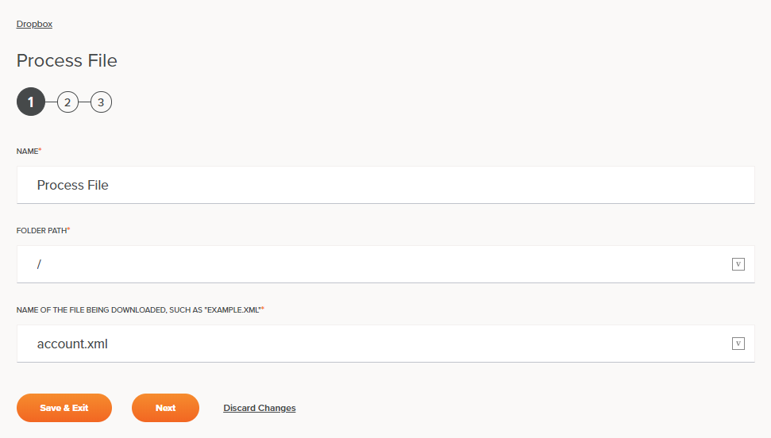
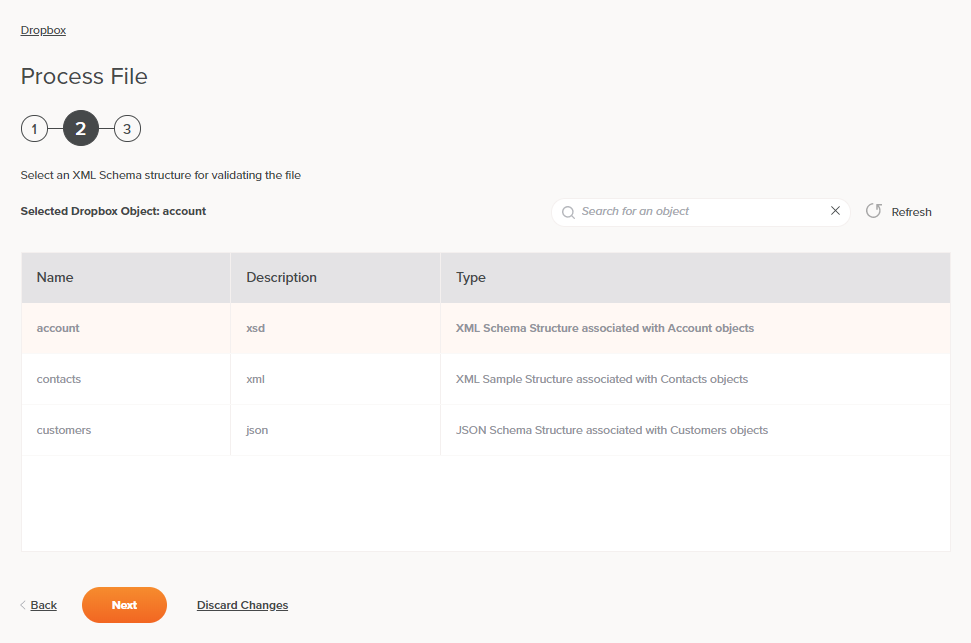

# Jitterbit Harmony Dropbox Process File Activity

## Introduction

A Dropbox process file activity retrieves data from a Dropbox connection and then processes the file based on a selected
schema, and is used as a source in an operation. After configuring a Dropbox connection, you can configure as many
Dropbox activities as you like for each Dropbox connection.

## Creating a Dropbox Activity

From the design canvas, open the **Connectivity** tab of the design component palette:

Within the **Endpoints** filter, click the Dropbox connection block to display activities that are available to be used
with a Dropbox connection:

To create an activity that can be configured, the activity must first be added to an operation on the design canvas. To
add an activity to an operation, drag the activity block from the palette to the operation.

For more information about the parts of an operation and adding activities to operations, see [Operation Creation and
Configuration](https://success.jitterbit.com/display/CS/Operation+Creation+and+Configuration).

## Accessing Menu Actions

After a Dropbox activity has been added to an operation, menu actions for that activity are accessible from the project
pane in either the **Workflows** or the **Components** tabs, and from the design canvas:

- **Project Pane:** In the **Workflows** or **Components** tab of the project pane, hover over an activity name and
  click the actions menu icon to open the actions menu.

- **Design Canvas:** Within the operation, click an existing activity block to open the actions menu.

Each of these menu actions is available:

- **View/Edit:** This opens the activity configuration screen for you to configure the activity. For details, see
  *Configuring a Dropbox Process File Activity* later on this page.

- **Delete:** This is used to permanently delete the activity.

- **View Dependencies:** This changes the view in the project pane to display any other parts of the project that the
  activity is dependent on.

- **Remove:** Available only from the actions menu on the design canvas, this removes the activity as a step in the
  operation without deleting it from the project. When you remove an activity that is adjacent to a transformation, if
  schemas are provided within that activity, they will no longer be referenced by the transformation. Removed components
  can be accessed or permanently deleted from the project pane.

- **Deploy:** This deploys the activity and any components it is dependent on.

- **Configurable Deploy:** This opens the deployment screen, where you can select project components to deploy.

## Configuring a Dropbox Process File Activity

Follow these steps to configure a Dropbox process file activity:

- Step 1 – Enter Basic Information
- Step 2 – Select the Dropbox Object
- Step 3 – Review Data Schema

### Step 1 – Enter Basic Information

**TIP:** Fields with a variable icon  support using global variables,
project variables, and Jitterbit variables. Begin typing an open square bracket `[` into the field or click the variable
icon to display existing variables to choose from.

- **Name:** Enter a name to use to identify the Dropbox process file activity. The name must be unique for each process file
  activity and must not contain forward slashes (`/`) or colons (`:`).

- **Folder Path:** Enter a valid path. The path should point to an existing directory on the Dropbox server. For
  example, `/inbound`.

- **Name of the File Being Downloaded:** Enter the name of the file(s) that you want to process from the path entered
  above. This field may also include an asterisk `*` to use as a wildcard (for example, `*.dat` or `*.*`) or a question
  mark `?` to match exactly one character (for example, `file?.txt`).

- **Save & Exit:** If enabled, click to save the configuration for this step and close the activity configuration.

- **Next:** Click to save the configuration for this step and continue to the next step.

- **Discard Changes:** After making changes to this step, click **Discard Changes** to close the configuration without
  saving changes to this step. A message will ask you to confirm that you want to discard changes.

### Step 2 – Select the Dropbox Object

In this step, select the Dropbox Object type that you want to use to process the data. The object selected will
determine the XML schema used when processing the data. You can enter an object name in the search field to filter the
list of objects and limit them to a subset of the entire list.

- **Back:** Click to save the configuration for this step and return to the previous step.

- **Next:** Click to save the configuration for this step and continue to the next step.

- **Discard Changes:** After making changes to this step, click **Discard Changes** if you want to close the
  configuration without saving changes to this step. A message will ask you to confirm that you want to discard changes.

### Step 3 – Review Data Schema

- **Data Schema:** The response data schema from Dropbox will be displayed. If the operation uses a transformation, the
  data schemas will be displayed again later during the transformation mapping process, where you can map to target
  fields using source objects, scripts, variables, custom values, and more.

- **Add Plugin(s):** Plugins are Jitterbit- or user-provided applications that extend Harmony's native capabilities. To
  apply a plugin to the activity, click to expand this section and select the checkbox next to the plugin to be used.
  For additional instructions on using plugins, including details on setting any required variables used by the plugin,
  see [Plugins Added to an Activity](https://success.jitterbit.com/display/CS/Plugins+Added+to+an+Activity).

- **Back:** Click to save the configuration for this step and return to the previous step.

- **Finished:** Click to save the configuration for this step and close the activity configuration.

- **Discard Changes:** After making changes to this step, click **Discard Changes** to close the configuration without
  saving changes to this step. A message will ask you to confirm that you want to discard changes.

## Next Steps

After configuring a Dropbox process file activity, complete the configuration of the operation by adding and configuring
other activities, transformations, or scripts as operation steps. You can also configure an operation's operation
settings, which include the ability to chain operations together that are in the same or different workflows.

Dropbox process file activities can be used as a source with the _Transformation Pattern_, _Two-Target Archive Pattern_,
or _Two-Target Transformation Pattern_. Other patterns are not valid using Dropbox process file activities.
See the validation rules on the [Operation Validity](https://success.jitterbit.com/display/CS/Operation+Validity) page.

To use the activity with scripting functions, write the data to a temporary location and then use that temporary
location in the scripting function.

When ready, deploy and run the operation and validate behavior by checking the operation logs.

## Related Pages

- [Jitterbit Harmony Dropbox Connection](./connection.md)
- [Dropbox Registration](./registration.md)
- [Jitterbit Harmony Dropbox Fetch File Activity](./fetch-file-activity.md)
- [Jitterbit Harmony Dropbox Get File Activity](./get-file-activity.md)
- [Jitterbit Harmony Dropbox Put File Activity](./put-file-activity.md)
